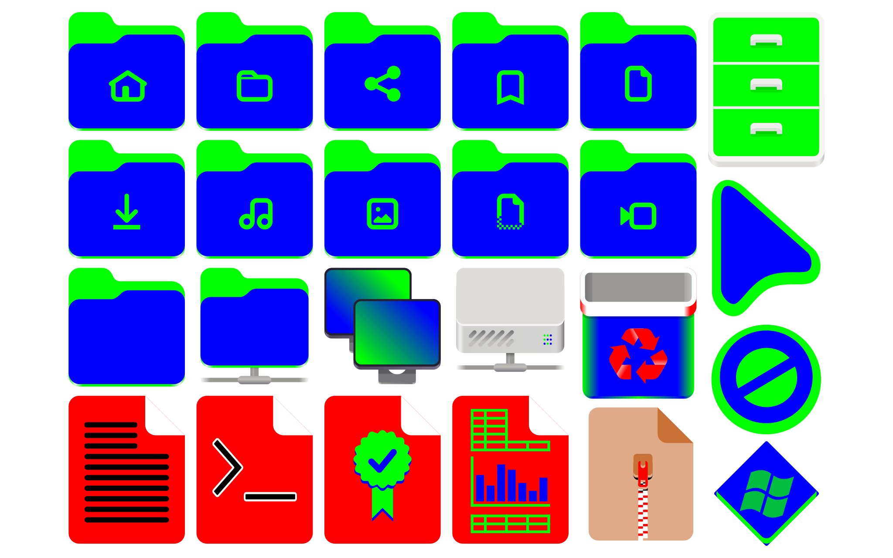

# PyTint

python package to colorize envy icons, themes, etc.

## colors

<div style="font-size: 32px;">
    <span style="
            background-color: #eea5aa;
            color: #da4e4e;
            border-radius: 0.5rem;
            padding: 0.2rem;"
    >red</span>
    <span style="
            background-color: #aaeea5;
            color: #34b234;
            border-radius: 0.5rem;
            padding: 0.2rem;"
    >green</span>
    <span style="
            background-color: #a4caee;
            color: #438de6;
            border-radius: 0.5rem;
            padding: 0.2rem;"
    >blue</span>
    <span style="
            background-color: #38dbd1;
            color: #139595;
            border-radius: 0.5rem;
            padding: 0.2rem;"
    >teal</span>
    <span style="
            background-color: #bfb3e5;
            color: #7f54d4;
            border-radius: 0.5rem;
            padding: 0.2rem;"
    >purple</span>
    <span style="
            background-color: #f4bed4;
            color: #ed5e8d;
            border-radius: 0.5rem;
            padding: 0.2rem;"
    >pink</span>
    <span style="
            background-color: #f1e774;
            color: #b2a400;
            border-radius: 0.5rem;
            padding: 0.2rem"
    >yellow</span>
    <span style="
            background-color: #f09e75;
            color: #c35622;
            border-radius: 0.5rem;
            padding: 0.2rem"
    >orange</span>
    <span style="
            background-color: #b78b7b;
            color: #6c4532;
            border-radius: 0.5rem;
            padding: 0.2rem"
    >brown</span>
    <span style="
            background-color: #c7cbcc;
            color: #6f8090;
            border-radius: 0.5rem;
            padding: 0.2rem"
    >slate</span>
</div>

## example blueprints



## example colorized

### blue icons, light theme


### pink icons, dark theme


## how does it work?

the pytint module operates on a single svg file, or a directory of svg files. it
takes an input blueprint, and converts the basic colors into the selected
scheme.

**the main blueprint scheme should consist of a combination of 5 colors:**

main colors:

-   <span style=" background-color: #00FF00; color: #000; border-radius:
    0.5rem;padding: 0.1rem;">\#00FF00</span>: default color
-   <span style=" background-color: #0000FF; color: #FFF; border-radius:
    0.5rem;padding: 0.1rem;">\#0000FF</span>: accent color

scheme colors:

-   <span style=" background-color: #FF0000; color: #000; border-radius:
    0.5rem;padding: 0.1rem;">\#FF0000</span>: background color
-   <span style=" background-color: #FFFFFF; color: #000; border-radius:
    0.5rem;padding: 0.1rem;">\#FFFFFF</span>: background accent color
-   <span style=" background-color: #000000; color: #FFF; border-radius:
    0.5rem;padding: 0.1rem;">\#000000</span>: difference color

**those colors are then converted in the following way:**

-   <span style=" background-color: #00FF00; color: #000; border-radius:
    0.5rem;padding: 0.1rem;">\#00FF00</span> &#8594; default
-   <span style=" background-color: #0000FF; color: #FFF; border-radius:
    0.5rem;padding: 0.1rem;">\#0000FF</span> &#8594; accent
-   <span style=" background-color: #FF0000; color: #000; border-radius:
    0.5rem;padding: 0.1rem;">\#FF0000</span> &#8594; variant
-   <span style=" background-color: #FFFFFF; color: #000; border-radius:
    0.5rem;padding: 0.1rem;">\#FFFFFF</span> &#8594; alt
-   <span style=" background-color: #000000; color: #FFF; border-radius:
    0.5rem;padding: 0.1rem;">\#000000</span> &#8594; difference

**examples:**

purple color, light scheme

-   default:
    <span style=" background-color: #00FF00; color: #000; border-radius:
    0.5rem;padding: 0.1rem;">\#00FF00</span> &#8594;
    <span style=" background-color: #7F54D4; color: #FFF; border-radius:
    0.5rem;padding: 0.1rem;">\#7F54D4</span>
-   accent: <span style=" background-color: #0000FF; color: #FFF; border-radius:
    0.5rem;padding: 0.1rem;">\#0000FF</span> &#8594;
    <span style=" background-color: #BFB3E5; color: #000; border-radius:
    0.5rem;padding: 0.1rem;">\#BFB3E5</span>
-   variant:
    <span style=" background-color: #FF0000; color: #000; border-radius:
    0.5rem;padding: 0.1rem;">\#FF0000</span> &#8594;
    <span style=" background-color: #1A1A1A; color: #FFF; border-radius:
    0.5rem;padding: 0.1rem;">\#1A1A1A</span>
-   alt: <span style=" background-color: #FFFFFF; color: #000; border-radius:
    0.5rem;padding: 0.1rem;">\#FFFFFF</span> &#8594;
    <span style=" background-color: #262626; color: #FFF; border-radius:
    0.5rem;padding: 0.1rem;">\#262626</span>
-   difference:
    <span style=" background-color: #000000; color: #FFF; border-radius:
    0.5rem;padding: 0.1rem;">\#000000</span> &#8594;
    <span style=" background-color: #F2F2F2; color: #000; border-radius:
    0.5rem;padding: 0.1rem;">\#F2F2F2</span>

yellow color, dark scheme

-   default:
    <span style=" background-color: #00FF00; color: #000; border-radius:
    0.5rem;padding: 0.1rem;">\#00FF00</span> &#8594;
    <span style=" background-color: #B2A400; color: #000; border-radius:
    0.5rem;padding: 0.1rem;">\#B2A400</span>
-   accent: <span style=" background-color: #0000FF; color: #FFF; border-radius:
    0.5rem;padding: 0.1rem;">\#0000FF</span> &#8594;
    <span style=" background-color: #F1E774; color: #000; border-radius:
    0.5rem;padding: 0.1rem;">\#F1E774</span>
-   variant:
    <span style=" background-color: #FF0000; color: #000; border-radius:
    0.5rem;padding: 0.1rem;">\#FF0000</span> &#8594;
    <span style=" background-color: #F2F2F2; color: #000; border-radius:
    0.5rem;padding: 0.1rem;">\#F2F2F2</span>
-   alt: <span style=" background-color: #FFFFFF; color: #000; border-radius:
    0.5rem;padding: 0.1rem;">\#FFFFFF</span> &#8594;
    <span style=" background-color: #E5E5E5; color: #000; border-radius:
    0.5rem;padding: 0.1rem;">\#E5E5E5</span>
-   difference:
    <span style=" background-color: #000000; color: #FFF; border-radius:
    0.5rem;padding: 0.1rem;">\#000000</span> &#8594;
    <span style=" background-color: #1A1A1A; color: #FFF; border-radius:
    0.5rem;padding: 0.1rem;">\#1A1A1A</span>

orange color, dark scheme, inverted

-   default:
    <span style=" background-color: #00FF00; color: #000; border-radius:
    0.5rem;padding: 0.1rem;">\#00FF00</span> &#8594;
    <span style=" background-color: #C35622; color: #000; border-radius:
    0.5rem;padding: 0.1rem;">\#C35622</span>
-   accent: <span style=" background-color: #0000FF; color: #FFF; border-radius:
    0.5rem;padding: 0.1rem;">\#0000FF</span> &#8594;
    <span style=" background-color: #F09E75; color: #000; border-radius:
    0.5rem;padding: 0.1rem;">\#F09E75</span>
-   variant:
    <span style=" background-color: #FF0000; color: #000; border-radius:
    0.5rem;padding: 0.1rem;">\#FF0000</span> &#8594;
    <span style=" background-color: #1A1A1A; color: #FFF; border-radius:
    0.5rem;padding: 0.1rem;">\#1A1A1A</span>
-   alt: <span style=" background-color: #FFFFFF; color: #000; border-radius:
    0.5rem;padding: 0.1rem;">\#FFFFFF</span> &#8594;
    <span style=" background-color: #262626; color: #FFF; border-radius:
    0.5rem;padding: 0.1rem;">\#262626</span>
-   difference:
    <span style=" background-color: #000000; color: #FFF; border-radius:
    0.5rem;padding: 0.1rem;">\#000000</span> &#8594;
    <span style=" background-color: #F2F2F2; color: #000; border-radius:
    0.5rem;padding: 0.1rem;">\#F2F2F2</span>

## usage

### pytint

colorize a single svg file

```py
from pytint.pytint import PyTint

# blueprint file
svg_in = "/home/user/blueprints/blueprint.svg"
# output file
svg_out = "/home/user/colorized/red.svg"

PyTint("red", "dark").tint_svg(svg_in, svg_out)

```

colorize all svgs in a directory

```py
svg_dir = "/home/user/blueprints"
out_dir = "/home/user/colorized"

# use inverted scheme (light theme uses dark colors)
PyTint("blue", "light", inverse_scheme=True).tint_batch(svg_dir, out_dir)
```

### colors

get default values list

```py
from pytint.colors import Colors

cols = Colors()
default_colors = cols.get_defaults()
print(f"default colors:\n{default_colors}")
```

get scheme variants list

```py
variants = cols.get_scheme_variants()
print(f"available variants:\n{variants}")
```

get supported colors list

```py
colors = cols.get_colors_list()
print(f"available colors:\n{colors}")
```

select scheme

```py
# normal
variant, alt, difference = cols.select_scheme("dark")
# inverted
variant, alt, difference = cols.select_scheme(variants[1], inverse=True)
```

select color

```py
default, accent = cols.select_color("blue")
print("blue: ", default, accent)
default, accent = cols.select_color(colors[0])
print(f"{colors[0]}: ", default, accent)
```
